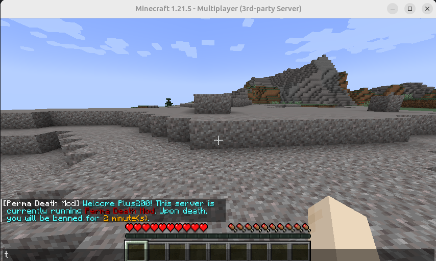
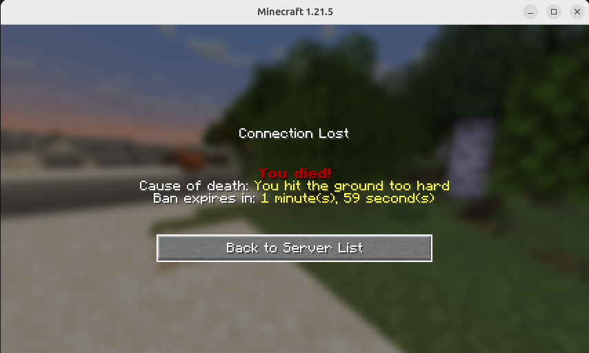
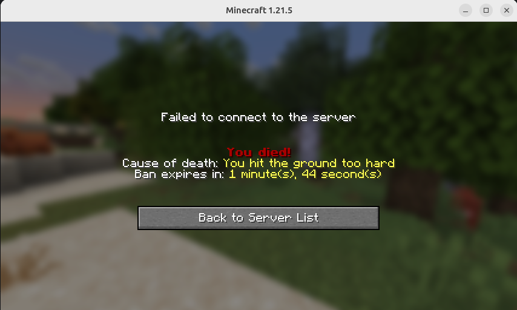

PermaDeath
==============
PermaDeath is the NeoForged 1.21.x fork of the [DeathBan mod](https://github.com/graacelin/DeathBan) which is not maintained anymore.

It's a server-side mod for Minecraft, meant to create a hardcore-like experience to survival servers by adding a configurable ban duration upon player death.  

The mod only needs to be added to the NeoForged server, so pure vanilla clients can also join a NeoForged server with PermaDeath installed (given the server **only** has server-only mods).

If you want this mod to be updated on next minecraft release, please consider to [donate](https://www.paypal.com/donate/?business=FA6Q8NVSX555G&no_recurring=0&item_name=OSS+Developer%2C+Modder.+++Thanks+for+your+donation%21&currency_code=EUR) !

Download
-----------

PermaDeath may be downloaded from any of the following sites:

- [Curse.com](https://www.curseforge.com/minecraft/mc-mods/perma-death)
- [Modrinth.com](https://modrinth.com/mod/perma-death)
- [Github Releases](https://github.com/jblemee/PermaDeath/releases)


Configuration
-----------
You can change the death duration in `config/permadeath-server.toml`. Note that the server does not need to be restarted for the changes to go through, but previous bans will not have their duration changed.

```
#The week duration of the death
Weeks = 0
#The day duration of the death
Days = 0
#The hour duration of the death
Hours = 0
#The minute duration of the death
Minutes = 0
```

Command
-----------
Operator can change the death expiration:

```
/pd add <DeadPlayer> <days>
/pd sub <DeadPlayer> <days>
```

Screenshots
-----------

\
A welcome message is sent to the player at login


\
Ban screen after dying


\
Screen when trying to reconnect


Contributing
=======

This repository can be directly cloned to get you started with the
mod

If at any point you are missing libraries in your IDE, or you've run into problems you can
run `gradlew --refresh-dependencies` to refresh the local cache. `gradlew clean` to reset everything
{this does not affect your code} and then start the process again.

Also, please consider to [donate](https://www.paypal.com/donate/?business=FA6Q8NVSX555G&no_recurring=0&item_name=OSS+Developer%2C+Modder.+++Thanks+for+your+donation%21&currency_code=EUR) !

Additional Resources:
-----------
Community Documentation: https://docs.neoforged.net/  
NeoForged Discord: https://discord.neoforged.net/

License
-----------

The 1.20 and previous versions were originally licensed by Grace Lin with MIT as we can see here: https://github.com/graacelin/DeathBan/blob/master/src/main/resources/META-INF/mods.toml
This repository sublicensed all the new and modified code with the WTFL licence.

If you think you have rights on this code, please contact me before engaging any legal action.
